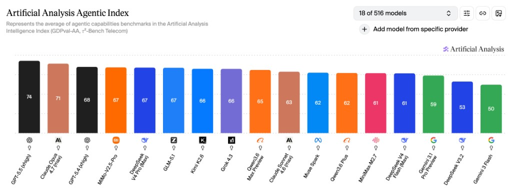

# AI Coding Plan 对比

> 更新日期2026.5.15 | 增加15个新平台，字节添加DeepseekV4

## 📖 简介

25大平台 智谱AI、Kimi、MiniMax、阿里·百炼、字节·方舟、小米·MiMo、讯飞·星火、百度·千帆、腾讯云、京东云，Coding Plan / Agent Plan 全面对比  
支持GLM-5.1，Qwen-3.6-Plus，Kimi-K2.6，MiniMax-M2.7，Doubao-Seed-2.0，MiMo-V2-Pro等模型

目前整体趋势是已经开始用Token Plan替换Coding Plan了，几个大厂阿里、字节、腾讯都改成Token Plan了，各位且买且珍惜吧

### 在线访问

直接访问：[https://www.codingplan.fyi](https://www.codingplan.fyi)

## 延伸阅读

- [国产主流模型能力对比：涵盖代码Coding Agent及Agentic养龙虾场景](articles/models_comparition_20260513/index.html)
基于 Artificial Analysis 公开榜单，横向对比智谱、DeepSeek、MiniMax、Kimi、Qwen、MiMo 等与海外头部差距，并附 Coding Plan / OpenClaw 场景的选型参考。

## 平台推荐

1. 智谱AI ⭐️⭐️⭐️⭐️⭐️
    - 支持GLM5.1模型。+1
    - 提供免费MCP次数。+1
    - **发现个抢购的[油猴脚本](https://greasyfork.org/zh-CN/scripts/571507-%E6%99%BA%E8%B0%B1-glm-coding-%E7%89%B9%E6%83%A0%E8%AE%A2%E8%B4%AD%E6%8A%A2%E8%B4%AD%E5%8A%A9%E6%89%8B) 打不开可以用[github讨论](https://github.com/wmpeng/codingplan/discussions/22)**
    - 模型能力T0级别，尤其适合作为代码场景，Opus平替。**可见👆上方能力评测。**
    - 需要抢购，能抢到就赚到。
2. MiniMax ⭐️⭐️⭐️⭐️⭐️
    - 提供的套餐中，常规价格最低。+1
    - 独占MiniMax-M2.7模型。+1
    - 最实惠、额度限制最小。适合养龙虾或者作为日常编程任务或者助手。
    - **极速版**稳定性比较好，TPS也相对高，比较少遇到限频。
3. 讯飞·星火 ⭐️⭐️⭐️⭐️⭐️
    - 支持GLM5.1。+1
    - 无忧版即支持无次Qwen3.5-35B-A3B（20M/日）。+0.5
    - 抢不到智谱的平替。无需抢购，39元即提供GLM5.1模型，用量比字节方舟要多不少。
4. Kimi ⭐️⭐️⭐️⭐️
    - 支持K2.6。+1
    - 提供实验性专业数据库功能。+0.5
    - 用量不明确，推测是比其他家用量要少一些。-1
    - 模型能力均衡，可用作代码编写和日常需求，支持多模态（图像输入）。

**评分标准**: 基准3颗星，价格优势劣势1分，模型优势或独占模型1分，其他优势1分。TokenPlan因性价比较低，暂不推荐，能买CodingPlan尽量买CodingPlan

## 📋 套餐对比表

| 平台 | 套餐 | 类型 | 链接 | 评分 | 标签 | 首月价格 | 连续包月 | 连续包季 | 连续包年 | 5小时请求数 | 每周请求数 | 每月总请求数 | Token上限 | 支持模型 | 其他权益 | 状态 | 备注 |
|------|------|------|------|------|------|---------|---------|---------|---------|-----------|-----------|-----------|-----------|---------|---------|------|------|
| 智谱AI | Lite | Coding Plan | [跳转](https://api.dreamfree.space/c/s/cpyqzhipu) | ⭐️⭐️⭐️⭐️⭐️ | 模型强 / 性价比高用量足 | ¥46.55 | ¥49 | ¥132 ~~147~~ / 季 | ¥470 ~~588~~ / 年 | 1,200 | 6,000 | 24,000 | 无限制 | GLM-5.1, GLM-5-Turbo | 免费MCP次数 | 在售 | • 3倍Claude Pro用量。官方以prompt计数，这里按1 prompt≈15次请求换算   • 官方只有周限量无月限量，这里按照1月=4周计算 |
| 智谱AI | Pro | Coding Plan | [跳转](https://api.dreamfree.space/c/s/cpyqzhipu) | ⭐️⭐️⭐️⭐️⭐️ | 模型强 / 性价比高用量足 | ¥141.55 | ¥149 | ¥402 ~~447~~ / 季 | ¥1430 ~~1788~~ / 年 | 6,000 | 30,000 | 120,000 | 无限制 | GLM-5.1, GLM-5-Turbo, GLM-5 | 免费MCP次数 | 在售 | • 5倍Lite用量。官方以prompt计数，这里按1 prompt≈15次请求换算   • 官方只有周限量无月限量，这里按照1月=4周计算 |
| 智谱AI | Max | Coding Plan | [跳转](https://api.dreamfree.space/c/s/cpyqzhipu) | ⭐️⭐️⭐️⭐️⭐️ | 模型强 / 性价比高用量足 | ¥445.55 | ¥469 | ¥1266 ~~1407~~ / 季 | ¥4502 ~~5628~~ / 年 | 24,000 | 120,000 | 480,000 | 无限制 | GLM-5.1, GLM-5-Turbo, GLM-5 | 免费MCP次数 | 在售 | • 20倍Lite用量。官方以prompt计数，这里按1 prompt≈15次请求换算   • 官方只有周限量无月限量，这里按照1月=4周计算 |
| 智谱国际版 | Lite | Coding Plan | [跳转](https://api.dreamfree.space/c/s/cpyqzai) | ⭐️⭐️⭐️⭐️ | 模型强 | $16.2 | $18 | $49 ~~54~~ / 季 | $173 ~~216~~ / 年 | 1,200 | 6,000 | 24,000 | 无限制 | GLM-5.1, GLM-5-Turbo | 免费MCP次数 | 在售 | • 3倍Claude Pro用量。官方以prompt计数，这里按1 prompt≈15次请求换算   • 官方只有周限量无月限量，这里按照1月=4周计算 |
| 智谱国际版 | Pro | Coding Plan | [跳转](https://api.dreamfree.space/c/s/cpyqzai) | ⭐️⭐️⭐️⭐️ | 模型强 | $64.8 | $72 | $194 ~~216~~ / 季 | $691 ~~864~~ / 年 | 6,000 | 30,000 | 120,000 | 无限制 | GLM-5.1, GLM-5-Turbo, GLM-5 | 免费MCP次数 | 在售 | • 5倍Lite用量。官方以prompt计数，这里按1 prompt≈15次请求换算   • 官方只有周限量无月限量，这里按照1月=4周计算 |
| 智谱国际版 | Max | Coding Plan | [跳转](https://api.dreamfree.space/c/s/cpyqzai) | ⭐️⭐️⭐️⭐️ | 模型强 | $144 | $160 | $432 ~~480~~ / 季 | $1536 ~~1920~~ / 年 | 24,000 | 120,000 | 480,000 | 无限制 | GLM-5.1, GLM-5-Turbo, GLM-5 | 免费MCP次数 | 在售 | • 4倍Pro用量。官方以prompt计数，这里按1 prompt≈15次请求换算   • 官方只有周限量无月限量，这里按照1月=4周计算 |
| MiniMax | Starter | Coding Plan | [跳转](https://api.dreamfree.space/c/s/cpyqminimax) | ⭐️⭐️⭐️⭐️⭐️ | 模型强 / 性价比高用量足 | ¥26.1 | ¥29 | - / 季 | ¥290 ~~348~~ / 年 | 600 | 6,000 | 24,000 | 无限制 | MiniMax-M2.7, MiniMax-M2.5 | - | 在售 | • 约50TPS   • 官方只有周限量无月限量，这里按照1月=4周计算 |
| MiniMax | Plus | Coding Plan | [跳转](https://api.dreamfree.space/c/s/cpyqminimax) | ⭐️⭐️⭐️⭐️⭐️ | 模型强 / 性价比高用量足 | ¥44.1 | ¥49 | - / 季 | ¥490 ~~588~~ / 年 | 1,500 | 15,000 | 60,000 | 无限制 | MiniMax-M2.7, MiniMax-M2.5 | - | 在售 | • 约50TPS   • 官方只有周限量无月限量，这里按照1月=4周计算 |
| MiniMax | Max | Coding Plan | [跳转](https://api.dreamfree.space/c/s/cpyqminimax) | ⭐️⭐️⭐️⭐️⭐️ | 模型强 / 性价比高用量足 | ¥107.1 | ¥119 | - / 季 | ¥1190 ~~1428~~ / 年 | 4,500 | 45,000 | 180,000 | 无限制 | MiniMax-M2.7, MiniMax-M2.5 | - | 在售 | • 约50TPS   • 官方只有周限量无月限量，这里按照1月=4周计算 |
| MiniMax | Plus-极速 | Coding Plan | [跳转](https://api.dreamfree.space/c/s/cpyqminimax) | ⭐️⭐️⭐️⭐️⭐️ | 模型强 / 性价比高用量足 | ¥88.2 | ¥98 | - / 季 | ¥980 ~~1176~~ / 年 | 1,500 | 15,000 | 60,000 | 无限制 | MiniMax-M2.7-highspeed, MiniMax-M2.5-highspeed | - | 在售 | • 约100TPS   • 官方只有周限量无月限量，这里按照1月=4周计算 |
| MiniMax | Max-极速 | Coding Plan | [跳转](https://api.dreamfree.space/c/s/cpyqminimax) | ⭐️⭐️⭐️⭐️⭐️ | 模型强 / 性价比高用量足 | ¥179.1 | ¥199 | - / 季 | ¥1990 ~~2388~~ / 年 | 4,500 | 45,000 | 180,000 | 无限制 | MiniMax-M2.7-highspeed, MiniMax-M2.5-highspeed | - | 在售 | • 约100TPS   • 官方只有周限量无月限量，这里按照1月=4周计算 |
| 讯飞·星火 | 专业版 | Coding Plan | [跳转](https://api.dreamfree.space/c/s/cpyqxunfei) | ⭐️⭐️⭐️⭐️⭐️ | 模型强 / 性价比高用量足 | - | ¥39 | - / 季 | - / 年 | 1,200 | 9,000 | 18,000 | 无限制 | GLM-5.1, Qwen-3.5-Plus, MiniMax-M2.5, Kimi-K2.5, DeepSeek-V3.2 | - | 在售 | • GLM-5.1已恢复200K上下文   • 讯飞实际用量比较高 |
| 讯飞·星火 | 高效版 | Coding Plan | [跳转](https://api.dreamfree.space/c/s/cpyqxunfei) | ⭐️⭐️⭐️⭐️ | 模型强 / 性价比高用量足 | - | ¥199 | - / 季 | - / 年 | 6,000 | 45,000 | 90,000 | 无限制 | GLM-5.1, Qwen-3.5-Plus, GLM-5, MiniMax-M2.5, Kimi-K2.5, DeepSeek-V3.2 | - | 在售 | • GLM-5.1已恢复200K上下文   • 讯飞实际用量比较高 |
| Kimi | Andante | Coding Plan | [跳转](https://api.dreamfree.space/c/s/cpyqkimi) | ⭐️⭐️⭐️⭐️ | 模型强 | - | ¥49 | - / 季 | ¥468 ~~588~~ / 年 | 未公开 | 未公开 | 未公开 | 无限制 | Kimi-K2.6, Kimi-K2.5, Kimi-K2 | - | 在售 | Agent 4 倍速 |
| Kimi | Moderato | Coding Plan | [跳转](https://api.dreamfree.space/c/s/cpyqkimi) | ⭐️⭐️⭐️⭐️ | 模型强 | - | ¥99 | - / 季 | ¥948 ~~1188~~ / 年 | 未公开 | 未公开 | 未公开 | 无限制 | Kimi-K2.6, Kimi-K2.5, Kimi-K2 | - | 在售 | 4 倍额度, Agent 多任务并行 |
| Kimi | Allegretto | Coding Plan | [跳转](https://api.dreamfree.space/c/s/cpyqkimi) | ⭐️⭐️⭐️⭐️ | 模型强 | - | ¥199 | - / 季 | ¥1908 ~~2388~~ / 年 | 未公开 | 未公开 | 未公开 | 无限制 | Kimi-K2.6, Kimi-K2.5, Kimi-K2 | 免费Kimi-Claw | 在售 | 20 倍额度 |
| Kimi | Allegro | Coding Plan | [跳转](https://api.dreamfree.space/c/s/cpyqkimi) | ⭐️⭐️⭐️⭐️ | 模型强 | - | ¥699 | - / 季 | ¥6708 ~~8388~~ / 年 | 未公开 | 未公开 | 未公开 | 无限制 | Kimi-K2.6, Kimi-K2.5, Kimi-K2 | 免费Kimi-Claw | 在售 | 60 倍额度 |
| 字节·方舟 | Lite | Coding Plan | [跳转](https://api.dreamfree.space/c/s/cpyqfangzhou) | ⭐️⭐️⭐️⭐️ | 模型强 | ¥36 | ¥40 | - / 季 | - / 年 | 1,200 | 9,000 | 18,000 | 无限制 | Doubao-Seed-2.0, MiniMax-M2.7, Kimi-K2.6, GLM-5.1, DeepSeek-V3.2 | ArkClaw 7天体验 | 在售 | • 5.8开始限购   • 模型倍率非常高，用量较低 |
| 字节·方舟 | Pro | Coding Plan | [跳转](https://api.dreamfree.space/c/s/cpyqfangzhou) | ⭐️⭐️⭐️⭐️ | 模型强 | ¥160 | ¥200 | - / 季 | - / 年 | 6,000 | 45,000 | 90,000 | 无限制 | Doubao-Seed-2.0, MiniMax-M2.7, Kimi-K2.6, GLM-5.1, DeepSeek-V3.2 | 免费ArkClaw | 在售 | • 5.8开始限购   • 模型倍率非常高，用量较低 |
| 字节·方舟 | Small | Token Plan | [跳转](https://api.dreamfree.space/c/s/cpyqfangzhout) | ⭐️⭐️⭐️ | 模型强 | - | ¥40 | - / 季 | - / 年 | 200 | 700 | 2,000 | 22M Tokens | Doubao-Seed-2.0, DeepSeek-V4-Pro, DeepSeek-V4-Flash, DeepSeek-V3.2, MiniMax-M2.7, GLM-5.1, Kimi-K2.6, Doubao-Seedream-5.0-lite | 联网搜索 50次/月 | 在售 | • 积分制 AFP 计费，见https://www.volcengine.com/docs/82379/2366394。   • 按照最优模型9倍系数计算，1AFP=1111Token。   • 有5小时、周、月的Token限制，没有请求次数限制，表格里按照最优模型，每次请求11KToken计算。 |
| 字节·方舟 | Medium | Token Plan | [跳转](https://api.dreamfree.space/c/s/cpyqfangzhout) | ⭐️⭐️⭐️ | 模型强 | - | ¥200 | - / 季 | - / 年 | 1,000 | 3,500 | 10,000 | 111M Tokens | Doubao-Seed-2.0, DeepSeek-V4-Pro, DeepSeek-V4-Flash, DeepSeek-V3.2, MiniMax-M2.7, GLM-5.1, Kimi-K2.6, Doubao-Seedream-5.0-lite, Doubao-Seedance-2.0 | 联网搜索 150次/月 | 在售 | • 积分制 AFP 计费，见https://www.volcengine.com/docs/82379/2366394。   • 按照最优模型9倍系数计算，1AFP=1111Token。   • 有5小时、周、月的Token限制，没有请求次数限制，表格里按照最优模型，每次请求11KToken计算。 |
| 字节·方舟 | Large | Token Plan | [跳转](https://api.dreamfree.space/c/s/cpyqfangzhout) | ⭐️⭐️⭐️ | 模型强 | - | ¥500 | - / 季 | - / 年 | 2,500 | 8,750 | 25,000 | 278M Tokens | Doubao-Seed-2.0, DeepSeek-V4-Pro, DeepSeek-V4-Flash, DeepSeek-V3.2, MiniMax-M2.7, GLM-5.1, Kimi-K2.6, Doubao-Seedream-5.0-lite, Doubao-Seedance-2.0 | 联网搜索 400次/月 | 在售 | • 积分制 AFP 计费，见https://www.volcengine.com/docs/82379/2366394。   • 按照最优模型9倍系数计算，1AFP=1111Token。   • 有5小时、周、月的Token限制，没有请求次数限制，表格里按照最优模型，每次请求11KToken计算。 |
| 字节·方舟 | Max | Token Plan | [跳转](https://api.dreamfree.space/c/s/cpyqfangzhout) | ⭐️⭐️⭐️ | 模型强 | - | ¥1000 | - / 季 | - / 年 | 5,000 | 17,500 | 50,000 | 556M Tokens | Doubao-Seed-2.0, DeepSeek-V4-Pro, DeepSeek-V4-Flash, DeepSeek-V3.2, MiniMax-M2.7, GLM-5.1, Kimi-K2.6, Doubao-Seedream-5.0-lite, Doubao-Seedance-2.0 | 联网搜索 800次/月 | 在售 | • 积分制 AFP 计费，见https://www.volcengine.com/docs/82379/2366394。   • 按照最优模型9倍系数计算，1AFP=1111Token。   • 有5小时、周、月的Token限制，没有请求次数限制，表格里按照最优模型，每次请求11KToken计算。 |
| 阿里·百炼 | 标准 | Token Plan | [跳转](https://api.dreamfree.space/c/s/cpyqbailiant) | ⭐️⭐️⭐️ | - | - | ¥198 | - / 季 | - / 年 | 无限制 | 无限制 | 无限制 | 150M Tokens | Qwen-3.6-Plus, Qwen-3.5-Plus, MiniMax-M2.5, DeepSeek-V3.2 | - | 在售 | • Qwen-3.6-Plus，输入5K Token/Credit，输入命中25K Token/Credit，输出0.83K Token/Credit   • 合输入¥1.58/MToken，缓存¥0.32/MToken，输出¥9.54/MToken   • 按缓存命中率90%，输入输出9:1算，约5.85K Token/Credit。表格按6K Token/Credit算 |
| 阿里·百炼 | 高级 | Token Plan | [跳转](https://api.dreamfree.space/c/s/cpyqbailiant) | ⭐️⭐️⭐️ | - | - | ¥698 | - / 季 | - / 年 | 无限制 | 无限制 | 无限制 | 600M Tokens | Qwen-3.6-Plus, Qwen-3.5-Plus, MiniMax-M2.5, DeepSeek-V3.2 | - | 在售 | • Qwen-3.6-Plus，输入5K Token/Credit，输入命中25K Token/Credit，输出0.83K Token/Credit   • 合输入¥1.40/MToken，缓存¥0.28/MToken，输出¥8.41/MToken   • 按缓存命中率90%，输入输出9:1算，约5.85K Token/Credit。表格按6K Token/Credit算 |
| 阿里·百炼 | 尊享 | Token Plan | [跳转](https://api.dreamfree.space/c/s/cpyqbailiant) | ⭐️⭐️⭐️ | - | - | ¥1398 | - / 季 | - / 年 | 无限制 | 无限制 | 无限制 | 1,500M Tokens | Qwen-3.6-Plus, Qwen-3.5-Plus, MiniMax-M2.5, DeepSeek-V3.2 | - | 在售 | • Qwen-3.6-Plus，输入5K Token/Credit，输入命中25K Token/Credit，输出0.83K Token/Credit   • 合输入¥1.12/MToken，缓存¥0.22/MToken，输出¥6.74/MToken   • 按缓存命中率90%，输入输出9:1算，约5.85K Token/Credit。表格按6K Token/Credit算 |
| 阿里·百炼 | Pro | Coding Plan | [跳转](https://api.dreamfree.space/c/s/cpyqbailianc) | ⭐️⭐️⭐️⭐️ | 性价比高用量足 | - | ¥200 | - / 季 | - / 年 | 6,000 | 45,000 | 90,000 | 无限制 | Qwen-3.6-Plus, Qwen-3.5-Plus, MiniMax-M2.5, GLM-5, Kimi-K2.5 | - | 在售 | 开始限量购买了，不确定每天放不放，放多少 |
| 小米·MiMo | Lite | Token Plan | [跳转](https://api.dreamfree.space/c/s/cpyqmimo) | ⭐️⭐️⭐️ | - | ¥34.32 | ¥39 | - / 季 | ¥412 ~~468~~ / 年 | 无限制 | 无限制 | 无限制 | 30M Tokens | MiMo-V2.5-Pro, MiMo-V2.5, MiMo-V2.5-TTS, MiMo-V2-Pro, MiMo-V2-Omni | TTS限时免费 | 在售 | • 60M(6000万) Credits，无5小时限额，支持集中消耗   • 按照2x计算Token，实际倍率：MiMo-V2.5:1x, Pro:2x |
| 小米·MiMo | Standard | Token Plan | [跳转](https://api.dreamfree.space/c/s/cpyqmimo) | ⭐️⭐️⭐️ | - | ¥87.12 | ¥99 | - / 季 | ¥1045 ~~1188~~ / 年 | 无限制 | 无限制 | 无限制 | 100M Tokens | MiMo-V2.5-Pro, MiMo-V2.5, MiMo-V2.5-TTS, MiMo-V2-Pro, MiMo-V2-Omni | TTS限时免费 | 在售 | • 200M(2亿) Credits，无5小时限额，支持集中消耗   • 按照2x计算Token，实际倍率：MiMo-V2.5:1x, Pro:2x |
| 小米·MiMo | Pro | Token Plan | [跳转](https://api.dreamfree.space/c/s/cpyqmimo) | ⭐️⭐️⭐️ | - | ¥289.52 | ¥329 | - / 季 | ¥3474 ~~3948~~ / 年 | 无限制 | 无限制 | 无限制 | 350M Tokens | MiMo-V2.5-Pro, MiMo-V2.5, MiMo-V2.5-TTS, MiMo-V2-Pro, MiMo-V2-Omni | TTS限时免费 | 在售 | • 700M(7亿) Credits，无5小时限额，支持集中消耗   • 按照2x计算Token，实际倍率：MiMo-V2.5:1x, Pro:2x |
| 小米·MiMo | Max | Token Plan | [跳转](https://api.dreamfree.space/c/s/cpyqmimo) | ⭐️⭐️⭐️ | - | ¥579.92 | ¥659 | - / 季 | ¥6959 ~~7908~~ / 年 | 无限制 | 无限制 | 无限制 | 800M Tokens | MiMo-V2.5-Pro, MiMo-V2.5, MiMo-V2.5-TTS, MiMo-V2-Pro, MiMo-V2-Omni | TTS限时免费 | 在售 | • 1600M(16亿) Credits，无5小时限额，支持集中消耗   • 按照2x计算Token，实际倍率：MiMo-V2.5:1x, Pro:2x |
| 联通云 | Lite | Coding Plan | [跳转](https://api.dreamfree.space/c/s/cpyqunicomcp) | ⭐️⭐️⭐️⭐️ | 模型强 | - | ¥40 | - / 季 | - / 年 | 1,200 | 9,000 | 18,000 | 无限制 | DeepSeek-V4-Flash, GLM-5.1, GLM-5, MiniMax-M2.5, Qwen-3.5-Plus, Kimi-K2.5 | - | 在售 | • 不同云区域可用模型不同   • 参考文档 https://support.cucloud.cn/document/127/591/2357.html?id=2357&arcid=7015 |
| 联通云 | Pro | Coding Plan | [跳转](https://api.dreamfree.space/c/s/cpyqunicomcp) | ⭐️⭐️⭐️⭐️ | 模型强 | - | ¥200 | - / 季 | - / 年 | 6,000 | 45,000 | 90,000 | 无限制 | DeepSeek-V4-Flash, GLM-5.1, GLM-5, MiniMax-M2.5, Qwen-3.5-Plus, Kimi-K2.5 | - | 在售 | • 不同云区域可用模型不同   • 参考文档 https://support.cucloud.cn/document/127/591/2357.html?id=2357&arcid=7015 |
| 联通云 | 个人 Lite | Token Plan | [跳转](https://api.dreamfree.space/c/s/cpyqunicomtp) | ⭐️ | - | - | ¥15 | - / 季 | - / 年 | 无限制 | 无限制 | 无限制 | 6M Tokens | DeepSeek-V4-Flash, MiniMax-M2.5 | - | 在售 | • 参考文档https://support.cucloud.cn/document/127/591/2357.html?id=2357&arcid=7080   • 上下文窗口目前仅支持 200K   |
| 联通云 | 个人 Pro | Token Plan | [跳转](https://api.dreamfree.space/c/s/cpyqunicomtp) | ⭐️ | - | - | ¥30 | - / 季 | - / 年 | 无限制 | 无限制 | 无限制 | 12M Tokens | DeepSeek-V4-Flash, MiniMax-M2.5 | - | 在售 | • 参考文档https://support.cucloud.cn/document/127/591/2357.html?id=2357&arcid=7080   • 上下文窗口目前仅支持 200K   |
| 联通云 | 个人 Max | Token Plan | [跳转](https://api.dreamfree.space/c/s/cpyqunicomtp) | ⭐️ | - | - | ¥45 | - / 季 | - / 年 | 无限制 | 无限制 | 无限制 | 18M Tokens | DeepSeek-V4-Flash, MiniMax-M2.5 | - | 在售 | • 参考文档https://support.cucloud.cn/document/127/591/2357.html?id=2357&arcid=7080   • 上下文窗口目前仅支持 200K   |
| 联通云 | 团队 Lite | Token Plan | [跳转](https://api.dreamfree.space/c/s/cpyqunicomtp) | ⭐️⭐️⭐️ | 模型强 | - | ¥198 | - / 季 | - / 年 | 无限制 | 无限制 | 无限制 | 200M Tokens | DeepSeek-V4-Pro, DeepSeek-V4-Flash, MiniMax-M2.5 | - | 在售 | • 参考文档https://support.cucloud.cn/document/127/591/2357.html?id=2357&arcid=7080   • 上下文窗口目前仅支持 200K   • 以 DeepSeek-V4-Pro 为例 25,000 credits约为 2亿tokens |
| 联通云 | 团队 Pro | Token Plan | [跳转](https://api.dreamfree.space/c/s/cpyqunicomtp) | ⭐️⭐️⭐️ | 模型强 | - | ¥698 | - / 季 | - / 年 | 无限制 | 无限制 | 无限制 | 800M Tokens | DeepSeek-V4-Pro, DeepSeek-V4-Flash, MiniMax-M2.5 | - | 在售 | • 参考文档https://support.cucloud.cn/document/127/591/2357.html?id=2357&arcid=7080   • 上下文窗口目前仅支持 200K   • 以 DeepSeek-V4-Pro 为例 25,000 credits约为 2亿tokens |
| 联通云 | 团队 Max | Token Plan | [跳转](https://api.dreamfree.space/c/s/cpyqunicomtp) | ⭐️⭐️⭐️ | 模型强 | - | ¥1398 | - / 季 | - / 年 | 无限制 | 无限制 | 无限制 | 2,000M Tokens | DeepSeek-V4-Pro, DeepSeek-V4-Flash, MiniMax-M2.5 | - | 在售 | • 参考文档https://support.cucloud.cn/document/127/591/2357.html?id=2357&arcid=7080   • 上下文窗口目前仅支持 200K   • 以 DeepSeek-V4-Pro 为例 25,000 credits约为 2亿tokens |
| 百度·千帆 | Lite | Coding Plan | [跳转](https://api.dreamfree.space/c/s/cpyqqianfan) | ⭐️⭐️⭐️ | - | - | ¥40 | - / 季 | - / 年 | 1,200 | 9,000 | 18,000 | 无限制 | GLM-5, Kimi-K2.5, MiniMax-M2.5, DeepSeek-V3.2 | - | 在售 | 使用 https://console.bce.baidu.com/qianfan/resource/subscribe 链接可以获得百度搜索额度，支持Baidu Search Skill |
| 百度·千帆 | Pro | Coding Plan | [跳转](https://api.dreamfree.space/c/s/cpyqqianfan) | ⭐️⭐️⭐️ | - | - | ¥200 | - / 季 | - / 年 | 6,000 | 45,000 | 90,000 | 无限制 | GLM-5, Kimi-K2.5, MiniMax-M2.5, DeepSeek-V3.2 | - | 在售 | 使用 https://console.bce.baidu.com/qianfan/resource/subscribe 链接可以获得百度搜索额度，支持Baidu Search Skill |
| 京东云 | Lite | Coding Plan | [跳转](https://api.dreamfree.space/c/s/cpyqjingdong) | ⭐️⭐️⭐️ | - | ¥19.9 | ¥40 | - / 季 | - / 年 | 1,200 | 9,000 | 18,000 | 无限制 | Kimi-K2.5, GLM-5, MiniMax-M2.5, DeepSeek-V3.2, Qwen-3-Coder | - | 在售 | - |
| 京东云 | Pro | Coding Plan | [跳转](https://api.dreamfree.space/c/s/cpyqjingdong) | ⭐️⭐️⭐️ | - | ¥99.9 | ¥200 | - / 季 | - / 年 | 6,000 | 45,000 | 90,000 | 无限制 | Kimi-K2.5, GLM-5, MiniMax-M2.5, DeepSeek-V3.2, Qwen-3-Coder | - | 在售 | - |
| 腾讯云 | Lite | Token Plan | [跳转](https://api.dreamfree.space/c/s/cpyqtengxunt) | ⭐️⭐️ | 模型强 | - | ¥39 | - / 季 | - / 年 | 无限制 | 无限制 | 无限制 | 35M Tokens | HY-2.0, GLM-5.1, MiniMax-M2.7, Kimi-K2.5 | - | 在售 | 注意此为TokenPlan，而非CodingPlan。35M(3500万) Tokens 额度，约 70 轮问答 |
| 腾讯云 | Standard | Token Plan | [跳转](https://api.dreamfree.space/c/s/cpyqtengxunt) | ⭐️⭐️ | 模型强 | - | ¥99 | - / 季 | - / 年 | 无限制 | 无限制 | 无限制 | 100M Tokens | HY-2.0, GLM-5.1, MiniMax-M2.7, Kimi-K2.5 | - | 在售 | 注意此为TokenPlan，而非CodingPlan。100M(1亿) Tokens 额度，可执行约 200 轮问答 |
| 腾讯云 | Pro | Token Plan | [跳转](https://api.dreamfree.space/c/s/cpyqtengxunt) | ⭐️⭐️ | 模型强 | - | ¥299 | - / 季 | - / 年 | 无限制 | 无限制 | 无限制 | 320M Tokens | HY-2.0, GLM-5.1, MiniMax-M2.7, Kimi-K2.5 | - | 在售 | 注意此为TokenPlan，而非CodingPlan。320M(3.2亿) Tokens 额度 |
| 腾讯云 | Max | Token Plan | [跳转](https://api.dreamfree.space/c/s/cpyqtengxunt) | ⭐️⭐️ | 模型强 | - | ¥599 | - / 季 | - / 年 | 无限制 | 无限制 | 无限制 | 650M Tokens | HY-2.0, GLM-5.1, MiniMax-M2.7, Kimi-K2.5 | - | 在售 | 注意此为TokenPlan，而非CodingPlan。650M(6.5亿) Tokens 额度 |
| 优云智算 | Mini 迷你版 | Coding Plan | [跳转](https://api.dreamfree.space/c/s/cpyqyyzs) | ⭐️⭐️⭐️ | 模型强 | - | ¥49 | - / 季 | - / 年 | 300 | 750 | 1,900 | 无限制 | GLM-5.1, Kimi-K2.6, MiniMax-M2.7, DeepSeek-V4-Flash, DeepSeek-V3.2 | - | 在售 | • 倍率不隐藏：DeepSeek-V3.2 x1，DeepSeek-V4-Flash x1，MiniMax-M2.7 x2，Kimi-K2.6 x5，GLM-5.1 x6   • 限流比较高：3 并发   • 价格较贵，性价比较低，但费率明确，无隐藏倍率 |
| 优云智算 | Lite 入门版 | Coding Plan | [跳转](https://api.dreamfree.space/c/s/cpyqyyzs) | ⭐️⭐️⭐️ | 模型强 | - | ¥99 | - / 季 | - / 年 | 600 | 1,500 | 3,800 | 无限制 | GLM-5.1, Kimi-K2.6, MiniMax-M2.7, DeepSeek-V4-Flash, DeepSeek-V3.2 | - | 在售 | • 倍率不隐藏：DeepSeek-V3.2 x1，DeepSeek-V4-Flash x1，MiniMax-M2.7 x2，Kimi-K2.6 x5，GLM-5.1 x6   • 限流比较高：5 并发   • 价格较贵，性价比较低，但费率明确，无隐藏倍率 |
| 优云智算 | Basic 基础版 | Coding Plan | [跳转](https://api.dreamfree.space/c/s/cpyqyyzs) | ⭐️⭐️⭐️ | 模型强 | - | ¥199 | - / 季 | - / 年 | 1,200 | 3,000 | 7,600 | 无限制 | GLM-5.1, Kimi-K2.6, MiniMax-M2.7, DeepSeek-V4-Flash, DeepSeek-V3.2 | - | 在售 | • 倍率不隐藏：DeepSeek-V3.2 x1，DeepSeek-V4-Flash x1，MiniMax-M2.7 x2，Kimi-K2.6 x5，GLM-5.1 x6   • 限流比较高：10 并发   • 价格较贵，性价比较低，但费率明确，无隐藏倍率 |
| 优云智算 | Pro 增强版 | Coding Plan | [跳转](https://api.dreamfree.space/c/s/cpyqyyzs) | ⭐️⭐️⭐️ | 模型强 | - | ¥499 | - / 季 | - / 年 | 3,000 | 7,500 | 19,000 | 无限制 | GLM-5.1, Kimi-K2.6, MiniMax-M2.7, DeepSeek-V4-Flash, DeepSeek-V3.2 | - | 在售 | • 倍率不隐藏：DeepSeek-V3.2 x1，DeepSeek-V4-Flash x1，MiniMax-M2.7 x2，Kimi-K2.6 x5，GLM-5.1 x6   • 限流比较高：10 并发   • 价格较贵，性价比较低，但费率明确，无隐藏倍率 |
| 优云智算 | Max 高级版 | Coding Plan | [跳转](https://api.dreamfree.space/c/s/cpyqyyzs) | ⭐️⭐️⭐️ | 模型强 | - | ¥799 | - / 季 | - / 年 | 4,800 | 12,000 | 31,000 | 无限制 | GLM-5.1, Kimi-K2.6, MiniMax-M2.7, DeepSeek-V4-Flash, DeepSeek-V3.2 | - | 在售 | • 倍率不隐藏：DeepSeek-V3.2 x1，DeepSeek-V4-Flash x1，MiniMax-M2.7 x2，Kimi-K2.6 x5，GLM-5.1 x6   • 限流比较高：10 并发   • 价格较贵，性价比较低，但费率明确，无隐藏倍率 |
| 优云智算 | Ultra 畅享版 | Coding Plan | [跳转](https://api.dreamfree.space/c/s/cpyqyyzs) | ⭐️⭐️⭐️ | 模型强 | - | ¥999 | - / 季 | - / 年 | 6,000 | 15,000 | 39,000 | 无限制 | GLM-5.1, Kimi-K2.6, MiniMax-M2.7, DeepSeek-V4-Flash, DeepSeek-V3.2 | - | 在售 | • 倍率不隐藏：DeepSeek-V3.2 x1，DeepSeek-V4-Flash x1，MiniMax-M2.7 x2，Kimi-K2.6 x5，GLM-5.1 x6   • 限流比较高：10 并发   • 价格较贵但费率明确，无隐藏倍率 |
| 阶跃星辰 | Flash Mini | Coding Plan | [跳转](https://api.dreamfree.space/c/s/cpyqstepfun) | ⭐️⭐️ | - | - | ¥49 | - / 季 | - / 年 | 1,500 | 6,000 | 24,000 | 无限制 | step-3.5-flash-2603, step-3.5-flash, step-router-v1 | - | 在售 | • 当前主打 Step 自有模型，模型较弱   • 官方以 prompt 计数，这里按 1 prompt≈15 次请求换算   • 官方只有周限量无月限量，这里按照 1 月=4 周计算 |
| 阶跃星辰 | Flash Plus | Coding Plan | [跳转](https://api.dreamfree.space/c/s/cpyqstepfun) | ⭐️⭐️ | - | - | ¥99 | - / 季 | - / 年 | 6,000 | 24,000 | 96,000 | 无限制 | step-3.5-flash-2603, step-3.5-flash, step-router-v1 | - | 在售 | • 当前主打 Step 自有模型，模型较弱   • 官方以 prompt 计数，这里按 1 prompt≈15 次请求换算   • 官方只有周限量无月限量，这里按照 1 月=4 周计算 |
| 阶跃星辰 | Flash Pro | Coding Plan | [跳转](https://api.dreamfree.space/c/s/cpyqstepfun) | ⭐️⭐️ | - | - | ¥199 | - / 季 | - / 年 | 22,500 | 90,000 | 360,000 | 无限制 | step-3.5-flash-2603, step-3.5-flash, step-router-v1 | - | 在售 | • 当前主打 Step 自有模型，模型较弱   • 官方以 prompt 计数，这里按 1 prompt≈15 次请求换算   • 官方只有周限量无月限量，这里按照 1 月=4 周计算 |
| 阶跃星辰 | Flash Max | Coding Plan | [跳转](https://api.dreamfree.space/c/s/cpyqstepfun) | ⭐️⭐️ | - | - | ¥699 | - / 季 | - / 年 | 75,000 | 300,000 | 1,200,000 | 无限制 | step-3.5-flash-2603, step-3.5-flash, step-router-v1 | - | 在售 | • 当前主打 Step 自有模型，模型较弱   • 官方以 prompt 计数，这里按 1 prompt≈15 次请求换算   • 官方只有周限量无月限量，这里按照 1 月=4 周计算 |
| 移动云 | Lite | Coding Plan | [跳转](https://api.dreamfree.space/c/s/cpyqmobilecp) | ⭐️⭐️⭐️ | - | ¥7.9 | ¥40 | - / 季 | - / 年 | 1,200 | 9,000 | 18,000 | 无限制 | MiniMax-M2.5 | - | 在售 | • 模型较弱   • 活动价首月 7.9 元，标准价 40 元/月，仅购买一个月时建议购买，不建议长期使用 |
| 移动云 | Pro | Coding Plan | [跳转](https://api.dreamfree.space/c/s/cpyqmobilecp) | ⭐️⭐️⭐️ | - | ¥39.9 | ¥200 | - / 季 | - / 年 | 6,000 | 45,000 | 90,000 | 无限制 | MiniMax-M2.5 | - | 在售 | • 模型较弱   • 活动价首月 7.9 元，标准价 40 元/月，仅购买一个月时建议购买，不建议长期使用 |
| 超算互联网 | Lite | Coding Plan | [跳转](https://api.dreamfree.space/c/s/cpyqscnetcp) | ⭐️⭐️ | 性价比高用量足 | - | ¥20 | - / 季 | - / 年 | 1,200 | 9,000 | 18,000 | 无限制 | MiniMax-M2.5, Qwen-3-235B-A22B | - | 在售 | • 模型较弱 |
| 超算互联网 | Pro | Coding Plan | [跳转](https://api.dreamfree.space/c/s/cpyqscnetcp) | ⭐️⭐️ | 性价比高用量足 | - | ¥100 | - / 季 | - / 年 | 6,000 | 45,000 | 90,000 | 无限制 | MiniMax-M2.5, Qwen-3-235B-A22B | - | 在售 | • 模型较弱 |
| 摩尔线程 | Free Trial | Coding Plan | [跳转](https://api.dreamfree.space/c/s/cpyqmoorefree) | ⭐️⭐️⭐️ | 性价比高用量足 | ¥0 | ¥0 | - / 季 | - / 年 | 未公开 | 未公开 | 未公开 | 无限制 | GLM-4.7 | - | 在售 | • 模型较弱   • Free Trial 每天上午 10:00 发放，限量 100 名，30 天有效   • 京东购买兑换码后需到卡券兑换页面兑换 |
| 商汤·日日新 | Free（公测） | Coding Plan | [跳转](https://api.dreamfree.space/c/s/cpyqsensenova) | ⭐️⭐️⭐️ | 性价比高用量足 | ¥0 | ¥0 | - / 季 | - / 年 | 1,500 | 未公开 | 未公开 | 未公开 | SenseNova 6.7 Flash-Lite, SenseNova U1 Fast, DeepSeek-V4-Flash | 256K 上下文 | 在售 | • 模型较弱   • 免费公测，Lite / Pro 未上线   • 日额度：SenseNova 6.7 Flash-Lite 1500 次、SenseNova U1 Fast 1500 次、DeepSeek-V4-Flash 150 次 |
| OpenCode Go | Go | Coding Plan | [跳转](https://api.dreamfree.space/c/s/cpyqopencode) | ⭐️⭐️⭐️⭐️⭐️ | 模型强 / 性价比高用量足 | $5 | $10 | - / 季 | - / 年 | 未公开 | 未公开 | 未公开 | 未公开 | GLM-5.1, GLM-5, Kimi-K2.6, MiMo-V2.5-Pro, MiMo-V2.5, Qwen-3.5-Plus, Qwen-3.6-Plus, MiniMax-M2.7, MiniMax-M2.5, DeepSeek-V4-Pro, DeepSeek-V4-Flash | 首月半价 | 在售 | • 套餐额度按美元 Credits 计：基础 12 美元、周额度 30 美元、月额度 60 美元   • 实际计费按 token 消耗 |
| Ollama | Pro | Coding Plan | [跳转](https://api.dreamfree.space/c/s/cpyqollama) | ⭐️⭐️⭐️ | 模型强 | - | $20 | - / 季 | $200 ~~240~~ / 年 | 未公开 | 未公开 | 未公开 | 未公开 | Kimi-K2.6, GLM-5.1, DeepSeek-V4-Pro, DeepSeek-V4-Flash, MiniMax-M2.7, Qwen-3-Coder, Qwen-3-Coder-next, Gemini-3-Flash-Preview, Mistral-Large-3 | 3 个并发任务 | 在售 | • 支持 GLM-5.1、Kimi-K2.6、MiniMax-M2.7、DeepSeek-V4-Pro，模型池很大   • Pro 为 Free 的 50 倍额度；可选年付 200 美元 |
| Ollama | Max | Coding Plan | [跳转](https://api.dreamfree.space/c/s/cpyqollama) | ⭐️⭐️⭐️ | 模型强 | - | $100 | - / 季 | - / 年 | 未公开 | 未公开 | 未公开 | 未公开 | Kimi-K2.6, GLM-5.1, DeepSeek-V4-Pro, DeepSeek-V4-Flash, MiniMax-M2.7, Qwen-3-Coder, Qwen-3-Coder-next, Gemini-3-Flash-Preview, Mistral-Large-3 | 10 个并发任务 | 在售 | • 支持 GLM-5.1、Kimi-K2.6、MiniMax-M2.7、DeepSeek-V4-Pro，模型池很大   • Max 为 Pro 的 5 倍额度 |
| OpenAI Codex | Plus | Coding Plan | [跳转](https://api.dreamfree.space/c/s/cpyqchatgpt) | ⭐️⭐️⭐️⭐️ | 模型强 | - | $20 | - / 季 | - / 年 | Plus 基准 | Plus 基准 | 未公开 | 未公开 | GPT-5.5, GPT-5.4, GPT-5.3-Codex, GPT-5.2, GPT-5.4-mini, GPT-Image-2.0 | 可购买额外积分 | 在售 | • 原生 Codex 套餐   • 官方按 5 小时与每周额度管理；免费版和 Go 套餐每周也有少量体验额度 |
| OpenAI Codex | Pro *5 | Coding Plan | [跳转](https://api.dreamfree.space/c/s/cpyqchatgpt) | ⭐️⭐️⭐️⭐️ | 模型强 | - | $100 | - / 季 | - / 年 | Plus 的 5 倍 | Plus 的 5 倍 | 未公开 | 未公开 | GPT-5.5, GPT-5.4, GPT-5.3-Codex, GPT-5.2, GPT-5.4-mini, GPT-Image-2.0 | 可购买额外积分 | 在售 | • 原生 Codex 套餐   • 截至 5 月 31 日前，官方标注可限时享 Plus 的 10 倍额度   • 6月1日起改按Token计费 |
| OpenAI Codex | Pro *20 | Coding Plan | [跳转](https://api.dreamfree.space/c/s/cpyqchatgpt) | ⭐️⭐️⭐️⭐️ | 模型强 | - | $200 | - / 季 | - / 年 | Plus 的 20 倍 | Plus 的 20 倍 | 未公开 | 未公开 | GPT-5.5, GPT-5.4, GPT-5.3-Codex, GPT-5.2, GPT-5.4-mini, GPT-Image-2.0 | 可购买额外积分 | 在售 | • 原生 Codex 套餐   • 官方按 5 小时与每周额度管理 |
| Claude Code | Pro | Coding Plan | [跳转](https://api.dreamfree.space/c/s/cpyqclaudeup) | ⭐️⭐️⭐️⭐️ | 模型强 | - | $20 | - / 季 | - / 年 | Pro 基准 | Pro 基准 | 未公开 | 未公开 | Claude Sonnet 4.6, Claude Sonnet 4.5, Claude Opus 4.7, Claude Opus 4.6, Claude Opus 4.5, Claude Haiku 4.5 | 原生 Claude Code 体验 | 在售 | • 原生 Claude Code 体验   • 部分用户订阅时可能被要求实名认证   • 套餐额度不可用于 OpenClaw、Hermes 等第三方编程 Agent |
| Claude Code | Max *5 | Coding Plan | [跳转](https://api.dreamfree.space/c/s/cpyqclaudeup) | ⭐️⭐️⭐️⭐️ | 模型强 | - | $100 | - / 季 | - / 年 | Pro 的 5 倍 | Pro 的 5 倍 | 未公开 | 未公开 | Claude Sonnet 4.6, Claude Sonnet 4.5, Claude Opus 4.7, Claude Opus 4.6, Claude Opus 4.5, Claude Haiku 4.5 | 原生 Claude Code 体验 | 在售 | • 原生 Claude Code 体验   • 部分用户订阅时可能被要求实名认证   • 套餐额度不可用于 OpenClaw、Hermes 等第三方编程 Agent |
| Claude Code | Max *20 | Coding Plan | [跳转](https://api.dreamfree.space/c/s/cpyqclaudeup) | ⭐️⭐️⭐️⭐️ | 模型强 | - | $200 | - / 季 | - / 年 | Pro 的 20 倍 | Pro 的 20 倍 | 未公开 | 未公开 | Claude Sonnet 4.6, Claude Sonnet 4.5, Claude Opus 4.7, Claude Opus 4.6, Claude Opus 4.5, Claude Haiku 4.5 | 原生 Claude Code 体验 | 在售 | • 原生 Claude Code 体验   • 部分用户订阅时可能被要求实名认证   • 套餐额度不可用于 OpenClaw、Hermes 等第三方编程 Agent |
| GitHub Copilot | 学生 | Coding Plan | [跳转](https://api.dreamfree.space/c/s/cpyqghstudent) | ⭐️⭐️⭐️⭐️⭐️ | 模型强 / 性价比高用量足 | $0 | $0 | - / 季 | - / 年 | 未公开 | 未公开 | 300 | 未公开 | GPT-4o, GPT-4.1, GPT-5-mini, GPT-5.2-Codex, Gemini 3.1 Pro, Claude Haiku 4.5, Grok Code Fast 1 | 学生认证免费 | 在售 | • 学生认证免费，高级模型可对话 300 次   • 存在周限额和 session 限额，不同模型有不同扣减倍率   • 学生版可通过 Auto 模式路由至 GPT-5.3-Codex |
| GitHub Copilot | Pro | Coding Plan | [跳转](https://api.dreamfree.space/c/s/cpyqghcopilot) | ⭐️⭐️⭐️⭐️ | 模型强 | - | $10 | - / 季 | - / 年 | 未公开 | 未公开 | 300 | 未公开 | GPT-5.3-Codex, GPT-5.4, Claude Sonnet 4.6, Gemini 3.1 Pro, Grok Code Fast 1 | 1000 积分 | 在售 | • 次数为对话次数，而非接口请求次数   • 存在周限额和 session 限额；不同模型有不同高级模型扣减倍率   • 目前暂时关闭新用户订阅权益激活，已有用户升级暂不受影响 |
| GitHub Copilot | Pro+ | Coding Plan | [跳转](https://api.dreamfree.space/c/s/cpyqghcopilotp) | ⭐️⭐️⭐️⭐️ | 模型强 | - | $39 | - / 季 | - / 年 | 未公开 | 未公开 | 1,500 | 未公开 | GPT-5.5, GPT-5.4, GPT-5.3-Codex, Claude Opus 4.7, Claude Sonnet 4.6, Gemini 3.1 Pro | 3900 积分 | 在售 | • 次数为对话次数，而非接口请求次数   • 存在周限额和 session 限额；不同模型有不同高级模型扣减倍率   • 官方说明自 6 月 1 日起统一改用 token 计费模式 |

💡 **说明**

- 包季/包年价格中的划线数字表示原始价格（包月×3 或 包月×12），未划线的为实际优惠价格。
- 使用表格邀请链接，部分平台可享优惠
- 本页面数据仅供参考，价格及权益最终以平台官方公布为准，建议在选择套餐前仔细阅读各平台的官方条款和服务协议

## 📝 更新日志

### 2026.5.15

- 增加15个新平台，字节添加DeepseekV4

### 2026.5.8

- 字节方舟上线AgentPlan，CodingPlan开始限购

### 2026.4.30

- 更新腾讯TokenPlan模型

### 2026.4.23

- 更新小米MiMo V2.5模型和倍率

### 2026.4.22

- 更新字节方舟&Kimi CodingPlan支持的模型

### 2026.4.21

- 阿里上线TokenPlan

### 2026.4.20

- 腾讯下线CodingPlan，仅保留TokenPlan

### 2026.4.16

- 去除讯飞·星火Lite套餐，因为其不包含主流SOTA模型

### 2026.4.15

- 添加讯飞·星火套餐数据

### 2026.4.14

- 增加类型列，区分CodingPlan和TokenPlan

### 2026.4.12

- 更新智谱AI国际版价格，智谱国际版大幅度涨价

### 2026.4.10

- 添加Qwen-3.6-Plus

### 2026.4.4

- 添加腾讯TokenPlan（非CodingPlan）

### 2026.4.3

- 添加小米·MiMo 及 京东·JoyBuilder

### 2026.3.28

- 更新智谱AI GLM-5.1 模型信息

## 🤝 贡献

欢迎提交 Issue 或 Pull Request 来完善本项目的数据和功能。

---

> 由扣子编程开发
