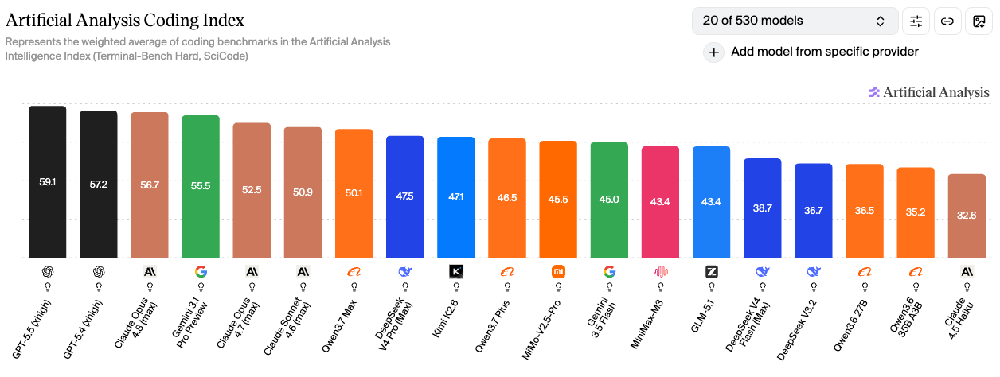
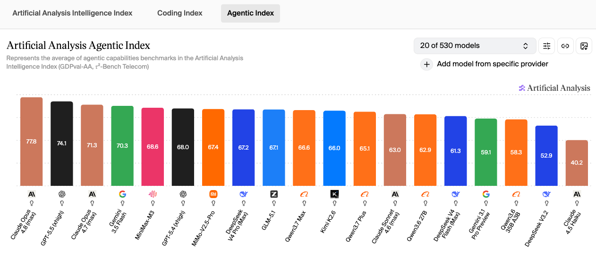

# 2026年6月主流大模型Coding能力深度对比：GPT-5.5 领跑 Coding 指数，Claude Opus 4.8 加冕 Agentic 王座，国产多款跻身全球前十

基于独立评测机构 Artificial Analysis 发布的最新 AI 模型基准测试结果（数据来源：2026年6月），本文围绕 **Coding 指数**（Terminal-Bench Hard + SciCode）和 **Agentic 智能指数**（GDPval-AA + 𝜏²-Bench Telecom）两大核心指标，对当下主流大模型进行横向评测，并补充 **ITBench-AA**（Kubernetes 事故根因分析）、**AA-Omniscience**（知识可靠性与幻觉率）、**GDPval-AA**（真实世界任务 Elo 评分）三个单独测试维度的详细数据。

这两项核心指标与日常代码开发需求和 OpenClaw、Harness 等通用 Agent 场景高度契合：
* Coding 能力直接决定模型代码生成、调试优化、代码库理解的水平
* Agentic 能力则是评估模型自主规划复杂任务、调度外部工具、驱动自动化流程的核心依据

从测试数据来看，国产头部大模型已全面跻身全球第一梯队，与 OpenAI、Anthropic 等海外厂商的顶尖产品差距进一步缩小，且在性价比、国内生态适配性方面具备独特优势。同时 6 月榜单迎来重大变化：**GPT-5.5 稳居 Coding 指数榜首**（59.1 分），**Claude Opus 4.8 凭借 77.8 分加冕 Agentic 智能指数新王**，Qwen3.7 Max、DeepSeek V4 Pro、Kimi K2.6、MiMo-V2.5-Pro 等国产旗舰共同跻身两大榜单全球前十。

## 一、快速对比总览（一张表看全部）

下表汇总了 6 月榜单中 19 款主流模型的四大关键指标，便于快速横向比较：

| 模型 | 上下文长度 | 多模态 | Coding 指数 | Agentic 智能指数 |
|------|----------|------|-----------|----------------|
| GPT-5.5 | 200K | ✅ 文本+图像+音频+视频 | 59.1 | 74.1 |
| GPT-5.4 | 200K | ✅ 文本+图像+音频+视频 | 57.2 | 68.0 |
| Claude Opus 4.8 | 200K | ✅ 文本+图像 | 56.7 | 77.8 |
| Gemini 3.1 Pro Preview | 2M | ✅ 文本+图像+音频+视频 | 55.5 | 59.1 |
| Claude Opus 4.7 | 200K | ✅ 文本+图像 | 52.5 | 71.3 |
| Claude Sonnet 4.6 | 200K | ✅ 文本+图像 | 50.9 | 63.0 |
| Qwen3.7 Max | 1M | ✅ 文本+图像+音频+视频 | 50.1 | 66.6 |
| DeepSeek V4 Pro | 128K | ❌ 纯文本 | 47.5 | 67.2 |
| Kimi K2.6 | 256K | ✅ 文本+图像 | 47.1 | 66.0 |
| Qwen3.7 Plus | 1M | ✅ 文本+图像+音频+视频 | 46.5 | 65.1 |
| MiMo-V2.5-Pro | 128K | ❌ 纯文本 | 45.5 | 67.4 |
| Gemini 3.5 Flash | 1M | ✅ 文本+图像+音频+视频 | 45.0 | 70.3 |
| MiniMax-M3 | 256K | ✅ 文本+图像 | 43.4 | 68.6 |
| GLM-5.1 | 128K | ✅ 文本+图像 | 43.4 | 67.1 |
| DeepSeek V4 Flash | 128K | ❌ 纯文本 | 38.7 | 61.3 |
| DeepSeek V3.2 | 64K | ❌ 纯文本 | 36.7 | 52.9 |
| Qwen3.6 27B | 128K | ❌ 纯文本 | 36.5 | 62.9 |
| Qwen3.6 35B A3B | 128K | ❌ 纯文本 | 35.2 | 58.3 |
| Claude 4.5 Haiku | 200K | ✅ 文本+图像 | 32.6 | 40.2 |

> 备注：上下文长度为各厂商公开标称值，实际可用窗口可能因 API 配置而异。多模态支持以模型原生能力为准，部分模型可通过工具调用扩展。

## 二、整体格局：GPT-5.5 稳居 Coding 王座，国产头部跻身全球前十

### 1. Artificial Analysis Coding 指数（代码核心指标）

数据来源：[Artificial Analysis - Coding Index](https://artificialanalysis.ai/?intelligence=coding-index&models=gpt-5-5%2Cgpt-5-5-pro%2Cgemini-3-1-pro-preview%2Cgemini-3-5-flash%2Cclaude-sonnet-4-6-adaptive%2Cclaude-opus-4-7%2Cclaude-4-5-haiku-reasoning%2Cclaude-opus-4-8%2Cdeepseek-v4-pro%2Cdeepseek-v4-flash%2Cminimax-m3%2Ckimi-k2-6%2Cmimo-v2-5-pro%2Cglm-5-1%2Cqwen3-6-35b-a3b%2Cqwen3-7-max%2Cqwen3-6-27b%2Cqwen3-7-plus%2Cgpt-5-4%2Cdeepseek-v3-2-reasoning#intelligence-tabs)

该指数整合 Terminal-Bench Hard（终端工具使用）与 SciCode（科研代码生成）两大测试维度，全面评估模型端到端完成软件工程任务的能力，是衡量 AI 编程工具实力的核心标准。

**Coding 指数 TOP 榜（2026年6月，530 个模型中前 19 位）：**
- 全球头部阵营：**GPT-5.5 59.1** 分稳居榜首，**GPT-5.4 57.2** 紧随其后，**Claude Opus 4.8 56.7** 排名第三
- 旗舰阵营：**Gemini 3.1 Pro Preview 55.5**、**Claude Opus 4.7 52.5**、**Claude Sonnet 4.6 50.9**
- 国产第一梯队（45 分以上）：**Qwen3.7 Max 50.1** 分排名全球第七，为国产模型首位；**DeepSeek V4 Pro 47.5**、**Kimi K2.6 47.1**、**Qwen3.7 Plus 46.5**、**MiMo-V2.5-Pro 45.5**、**MiniMax-M3 43.4**、**GLM-5.1 43.4** 紧随其后
- 中小模型阵营：**Gemini 3.5 Flash 45.0**、**DeepSeek V4 Flash 38.7**、**DeepSeek V3.2 36.7**、**Qwen3.6 27B 36.5**、**Qwen3.6 35B A3B 35.2**、**Claude 4.5 Haiku 32.6**

### 2. Agentic 智能指数（通用 Agent 核心指标）

数据来源：[Artificial Analysis - Agentic Index](https://artificialanalysis.ai/?intelligence=agentic-index&models=gpt-5-5%2Cgpt-5-5-pro%2Cgemini-3-1-pro-preview%2Cgemini-3-5-flash%2Cclaude-sonnet-4-6-adaptive%2Cclaude-opus-4-7%2Cclaude-4-5-haiku-reasoning%2Cclaude-opus-4-8%2Cdeepseek-v4-pro%2Cdeepseek-v4-flash%2Cminimax-m3%2Ckimi-k2-6%2Cmimo-v2-5-pro%2Cglm-5-1%2Cqwen3-6-35b-a3b%2Cqwen3-7-max%2Cqwen3-6-27b%2Cqwen3-7-plus%2Cgpt-5-4%2Cdeepseek-v3-2-reasoning#intelligence-tabs)

该指数综合 GDPval-AA 真实世界任务执行能力与 𝜏²-Bench Telecom 工具调用能力两大基准，量化评估模型自主完成多步骤复杂任务的表现，是衡量 OpenClaw 自动化运营潜力的核心标准。

**Agentic 指数 TOP 榜（2026年6月，530 个模型中前 19 位）：**
- 全球头部阵营：**Claude Opus 4.8 77.8** 登顶，**GPT-5.5 74.1**、**Claude Opus 4.7 71.3** 占据全球前三
- 旗舰阵营：**Gemini 3.5 Flash 70.3**、**MiniMax-M3 68.6**、**GPT-5.4 68.0**、**MiMo-V2.5-Pro 67.4**、**DeepSeek V4 Pro 67.2**、**GLM-5.1 67.1** 紧随其后
- 国产第一梯队（66 分以上）：**Qwen3.7 Max 66.6**、**Kimi K2.6 66.0**、**Qwen3.7 Plus 65.1** 全部跻身全球前 12
- 性价比与开源阵营：**Claude Sonnet 4.6 63.0**、**Qwen3.6 27B 62.9**、**DeepSeek V4 Flash 61.3**、**Gemini 3.1 Pro Preview 59.1**、**Qwen3.6 35B A3B 58.3**、**DeepSeek V3.2 52.9**、**Claude 4.5 Haiku 40.2**

## 三、单独测试维度详解

### 1. ITBench-AA（Kubernetes 事故根因分析，企业级 SRE 场景）

**ITBench-AA TOP 榜（24 个模型中前 14 位）：**
- **Claude Opus 4.7 46.7%** 居首，**GPT-5.5 45.8%** 第二，**Qwen3.7 Max 42.5%** 排名第三，是国产模型中 SRE 场景表现最强的
- **Gemini 3.5 Flash 40.3%**、**GLM-5.1 40.3%**、**Claude Sonnet 4.6 39.8%** 紧随其后
- **DeepSeek V4 Pro 38.3%**、**MiMo-V2.5-Pro 38.2%**、**GPT-5.4 34.5%**、**DeepSeek V4 Flash 31.5%**、**Kimi K2.6 31.2%** 同样表现优异，**MiniMax-M2.7 26.5%** 也进入了前 14

### 2. AA-Omniscience（知识可靠性与幻觉率）

**AA-Omniscience TOP 10：**
- 知识最可靠：**Gemini 3.1 Pro Preview (33)**、**Claude Opus 4.8 (27)**、**Claude Opus 4.7 (26)** 占据前三
- **Gemini 3.5 Flash (23)**、**GPT-5.5 (20)**、**Qwen3.7 Max (14)** 知识可靠性突出
- **Claude Sonnet 4.6 (12)** 表现稳定
- 国产模型中 **Kimi K2.6 (6)**、**MiMo-V2.5-Pro (3)**、**Qwen3.7 Plus (2)**、**GLM-5.1 (1)**、**MiniMax-M3 (1)** 知识可靠性优秀；海外阵营中 **GPT-5.4 (4)** 同样可靠

### 3. GDPval-AA（真实世界任务 Elo 评分）

GDPval-AA 是 Agentic 智能指数的核心子项，基于真实世界任务（涉及金融、咨询、销售、运营等职业任务）的成对对比 Elo 评分（分数越高越好），是衡量模型在 OpenClaw 等真实业务场景下表现的最直接指标。

**GDPval-AA Elo TOP 榜（2026年6月，23 个模型中前 19 位）：**
- 全球头部阵营：**Claude Opus 4.8 1890** 登顶，**GPT-5.5 1769**、**Claude Opus 4.7 1753** 占据全球前三
- 旗舰阵营：**Claude Sonnet 4.6 1676**、**GPT-5.4 1674**、**MiniMax-M3 1670**、**Gemini 3.5 Flash 1656** 紧随其后
- 国产第一梯队：**MiMo-V2.5-Pro 1571**、**DeepSeek V4 Pro 1554**、**Qwen3.7 Max 1546**、**GLM-5.1 1535**、**Qwen3.7 Plus 1522**、**MiniMax-M2.7 1505**、**Kimi K2.6 1481** 全部跻身全球前 15
- 性价比与开源阵营：**Qwen3.6 27B 1404**、**DeepSeek V4 Flash 1388**、**Qwen3.6 Plus 1353**、**Gemini 3.1 Pro Preview 1314**、**Qwen3.6 35B A3B 1298**、**Kimi K2.5 1285**、**DeepSeek V3.2 1197**、**Claude 4.5 Haiku 1171**

## 四、国产核心厂商模型深度解析

### 1. Qwen3.7 Max（阿里）：Coding 国产第一，全面领跑

Qwen3.7 Max 在 6 月榜单中表现亮眼，**Coding 指数 50.1** 分排名全球第七，是国产模型中代码能力最强的；**Agentic 智能指数 66.6** 分跻身全球第十；**ITBench-AA 42.5%** 位居全球第三，SRE 场景表现突出；**AA-Omniscience 14** 分知识可靠性同样优秀。是国产 AI 编程领域的标杆。

阿里 Qwen 系列已建立完整的产品矩阵：Qwen3.7 Max（旗舰）、Qwen3.7 Plus（高性价比）、Qwen3.6 27B、Qwen3.6 35B A3B 等多档可选。但目前 Qwen 渠道主要通过阿里云百炼 API 销售，个人使用推荐购买 Token Plan 套餐，Qwen3.7 系列模型都可使用。

### 2. DeepSeek V4 Pro（深度求索）：开源标杆，均衡旗舰

DeepSeek V4 Pro 在 6 月榜单中依然保持强势：**Coding 指数 47.5** 分全球第八，**Agentic 智能指数 67.2** 分跻身全球第八，**ITBench-AA 38.3%** 全球第七，**AA-Omniscience (-10)** 表现稳定。是开源开放度最高的旗舰模型之一。

DeepSeek 独特优势：
- 完整的开源权重（V4 Pro / V4 Flash 均可商用）
- 独创的缓存机制使得缓存命中率高、缓存价格极低
- **DeepSeek V4 Flash** 输出速度极快、单价低（0.2 美元/百万 token，Cache 命中价更低）
- 产品矩阵覆盖：V4 Pro、V4 Flash、V3.2 等多个档位

### 3. GLM-5.1（智谱AI）：综合能力均衡，企业级 SRE 优选

GLM-5.1 在 6 月榜单中维持国产顶级水准：**Coding 指数 43.4** 分，**Agentic 智能指数 67.1** 分跻身全球第九，**ITBench-AA 40.3%** 排名全球第五，**AA-Omniscience 1** 知识可靠性表现优秀。GLM-5.1 完全开源。

GLM-5.1 在 Claude Code 框架下表现稳定，是技术开发场景的可靠选择。其 Agentic 智能指数同样达到国产顶尖水平，能够支撑 OpenClaw 复杂流程的自主调度。

缺点：算力瓶颈较严重，Coding Plan 经常需要抢购，很难买到。

### 4. Kimi K2.6（月之暗面）：长上下文能力突出，编码功底扎实

Kimi K2.6 在 6 月榜单中表现稳健：**Coding 指数 47.1** 分排名全球第九，**Agentic 智能指数 66.0** 分跻身全球第十一，**AA-Omniscience 6** 分知识可靠性优秀。Kimi K2.6 同样开源。

Kimi 核心优势：
- 长上下文支持图像输入
- 模型代码能力优秀
- 较高强度日常开发够用
- 购买 Coding Plan 送专属龙虾
- **Allegretto 套餐 ￥199/月** 性价比突出

### 5. MiniMax-M2.7/M3（稀宇科技）：高性价比、响应快

MiniMax 系列在 6 月榜单中表现亮眼：**MiniMax-M3 Coding 指数 43.4** 分、**Agentic 智能指数 68.6** 分跻身全球第五（国产最高）、**AA-Omniscience 1** 知识可靠性突出；**MiniMax-M2.7 Coding 指数 42.9** 分，**AA-Omniscience -1**，开源但开放度稍低于其他国产旗舰。

MiniMax 核心优势：
- 模型参数量较小使得 **Coding Plan 套餐最实惠、额度限制最小**
- 极速版套餐输出 Token 速率高、很少出现 429
- 用量限制高、可用性优于其他平台
- 日常交互体验出色，适合作为 OpenClaw 辅助工具

### 6. MiMo-V2.5-Pro（小米）：Agentic 能力国产第一梯队

MiMo-V2.5-Pro 在 6 月榜单中表现优异：**Coding 指数 45.5** 分、**Agentic 智能指数 67.4** 分跻身全球第七，**ITBench-AA 38.2%**、**AA-Omniscience 3** 知识可靠性突出。MiMo-V2.5-Pro 完全开源。

MiMo 核心优势：
- Agentic 智能指数（67.4）领先 DeepSeek V4 Pro（67.2）和 GLM-5.1（67.1），是国产模型 Agentic 能力第一
- 多工具协同调度、复杂自主流程执行方面表现接近 Claude Opus 系列
- 是驱动 OpenClaw 全流程自动化的最优选择之一
- 性价比高，企业集成成本低

### 7. Gemini 3.5 Flash（谷歌）：输出速度之王，性价比突出

Gemini 3.5 Flash 在 6 月榜单中表现惊艳：**Coding 指数 45.0** 分，**Agentic 智能指数 70.3** 分跻身全球第四，**ITBench-AA 40.3%** 排名全球第四，**AA-Omniscience 23** 知识可靠性排名第四。**344 tokens/s** 输出速度全场最快。

Gemini 核心优势：
- 输出速度极快、价格便宜
- 知识可靠性优秀
- 多模态能力强
- 适合高并发、低延迟场景

## 五、个人使用选型参考指南（2026年6月更新）

结合代码开发需求及 OpenClaw 场景，可根据具体场景针对性选择：

- **复杂代码开发与生产级系统搭建**：首选 **Qwen3.7 Max**，其编码能力国产第一；**Claude Opus 4.8**、**Kimi K2.6** 与 **DeepSeek V4 Pro** 可作为备选。
- **预算有限的个人开发者**：**Qwen3.7 Plus 46.5**、**MiniMax-M2.7 42.9**、**DeepSeek V4 Flash 38.7** 提供优秀的性价比。
- **OpenClaw 核心与复杂任务**：优先选择 Agentic 指数全球前十的模型：**Claude Opus 4.8 (77.8)**、**GPT-5.5 (74.1)**、**Claude Opus 4.7 (71.3)**、**Gemini 3.5 Flash (70.3)**、**MiniMax-M3 (68.6)**、**GPT-5.4 (68.0)**、**MiMo-V2.5-Pro (67.4)**、**DeepSeek V4 Pro (67.2)**、**GLM-5.1 (67.1)**、**Qwen3.7 Max (66.6)**。
- **OpenClaw 日常任务**：优先选择 **MiniMax-M2.7** 和 **DeepSeek V4 Flash**，流畅的响应和高用量限制，能满足标准化日常助力需求。
- **企业级 SRE 场景（Kubernetes 运维）**：**Claude Opus 4.7 (46.7%)**、**GPT-5.5 (45.8%)**、**Qwen3.7 Max (42.5%)** 表现最强。
- **追求极致性价比**：**DeepSeek V4 Flash (0.2美元/M token)** 价格最低，**Qwen3.6 35B A3B / Qwen3.6 27B** 提供了高质量的开源替代。
- **日常聊天**：推荐直接用豆包、千问等普通版即可，没必要订阅 Coding 套餐。

## 六、2026年6月榜单重大变化总结

1. **GPT-5.5** 继续稳居 Coding 指数榜首（59.1 分），与 GPT-5.4 (57.2)、Claude Opus 4.8 (56.7) 共同构成第一梯队
2. **Claude Opus 4.8** 凭借 77.8 分在 Agentic 智能指数登顶，成为 Agentic 新王
3. **Qwen3.7 Max** 首次跻身全球 Coding 指数前十（第七），是国产 AI 编程能力之巅
4. **Gemini 3.5 Flash** 凭借 344 tokens/s 输出速度全场最快，Agentic 智能指数 70.3 分跻身全球第四
5. **DeepSeek V4 Flash** 以 0.2 美元/M token 创下旗舰模型单价新低
6. **MiniMax-M3** Agentic 智能指数 68.6 分跻身全球第五，国产阵营进一步壮大
7. **Qwen3.7 Plus** 紧随 Qwen3.7 Max 发布，Coding 指数 46.5 分提供高性价比选择
